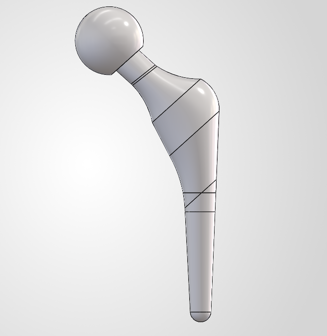
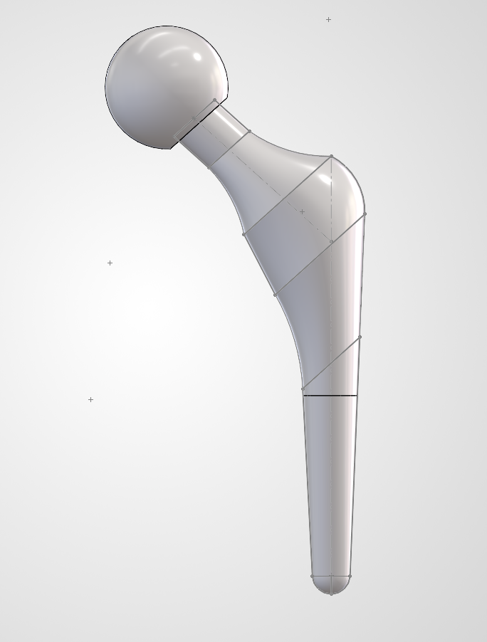
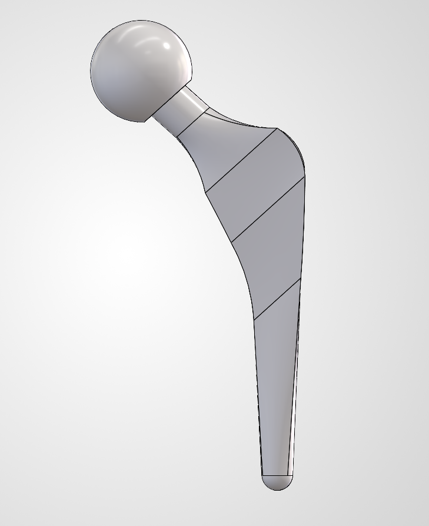

# Hip Stem FEA

Finite element analysis of a femoral hip stem implant, evaluating stress distribution under simulated physiological loading. Three cross-sectional stem geometries — elliptical, circular, and trapezoidal — with two loads and two materials are compared to assess the effect of cross-section shape on stress performance.

<!-- 
## Design

Dimensioned sketch showing key geometry and critical dimensions of the stem.


-->

## 3D Model

An interactive 3D model of the circular hip stem (baseline) is also available as an STL file: [`model/hip-stem.stl`](model/circular_ti_load1_hip_stem.STL). Open it directly in GitHub to rotate and inspect the geometry.

## Design

Three stem geometries were modeled and analyzed for comparison:

| Circular | Elliptical | Trapezoidal |
|---|---|---|
|  |  |  |

## Loading & Boundary Conditions [WIP]

Applied load and fixture/restraint locations used in the simulation.


*[Add a short note here on load magnitude/direction, e.g. "2600 N axial, simulating peak gait load"]*

## Stress Results [WIP]

Von Mises stress distribution for each cross-section variant.

| Elliptical | Circular | Trapezoidal |
|---|---|---|
|  |  |  |

*[Add a short summary here — e.g. peak stress values, which geometry performed best, and why]*

## Repository Structure

```
hip-stem-FEA/
├── README.md
├── images/
│   ├── elliptical-hip-stem.png
│   ├── circular-hip-stem.png
│   ├── trapezoidal-hip-stem.png
└── model/
    └── hip-stem.stl
```

## Software

- SolidWorks (part modeling)
- SolidWorks Simulation (FEA)
